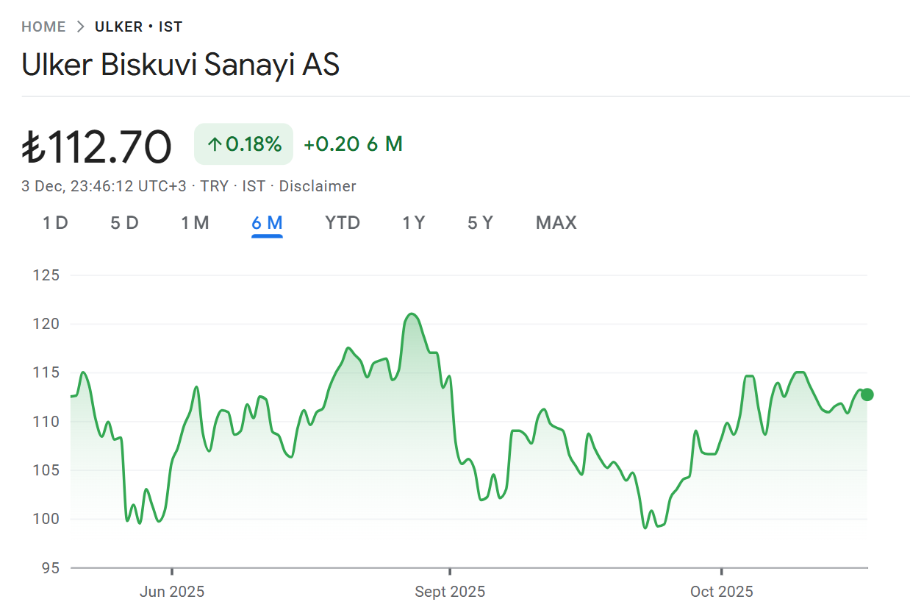
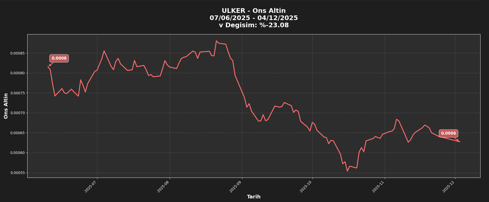

# BIST Stock Analysis (StockApp)

A modern Python/Tkinter desktop application for analyzing **Borsa
İstanbul (BIST)** stocks in different units such as USD or Gold.

This repository contains: - The full application source code - Local
caching system - Modern dark-themed UI - Automatic FX conversion -
Interactive charts using Matplotlib

------------------------------------------------------------------------

## Features

-   Analyze any BIST stock\
-   Convert stock prices to **USD** or **Gold**\
-   Custom date selection (start/end)\
-   Quick timeframes (1W, 1M, 6M, 1Y, 3Y, etc.)\
-   Auto-adjusting FX data\
-   Cached data for faster repeated use\
-   Clean chart with annotated first/last values

------------------------------------------------------------------------

## Screenshots

You can replace these placeholder images with your own screenshots:

### 📈 6-Month TL Chart (From Internet)



### 🖥️ 6-Month TL Chart (From Application)



------------------------------------------------------------------------

## Installation

``` bash
git clone https://github.com/yourusername/stockapp.git
cd stockapp
pip install -r requirements.txt
python main.py
```

If you don't have a `requirements.txt`, install manually:

``` bash
pip install yfinance pandas matplotlib tkcalendar
```

------------------------------------------------------------------------

## Usage

1.  Enter a BIST stock ticker\
2.  Select USD or Gold\
3.  Pick custom dates or use quick shortcuts\
4.  Click **Analyze**\
5.  The chart will update with percent change & annotations

------------------------------------------------------------------------

## Project Structure

    stockapp/
     ├── main.py
     ├── README.md
     └── screenshots/
           ├── internet_chart.png
           └── app_chart.png

------------------------------------------------------------------------

## License

MIT License

------------------------------------------------------------------------

## Author

Developed by **Vakkas Karakurt**
